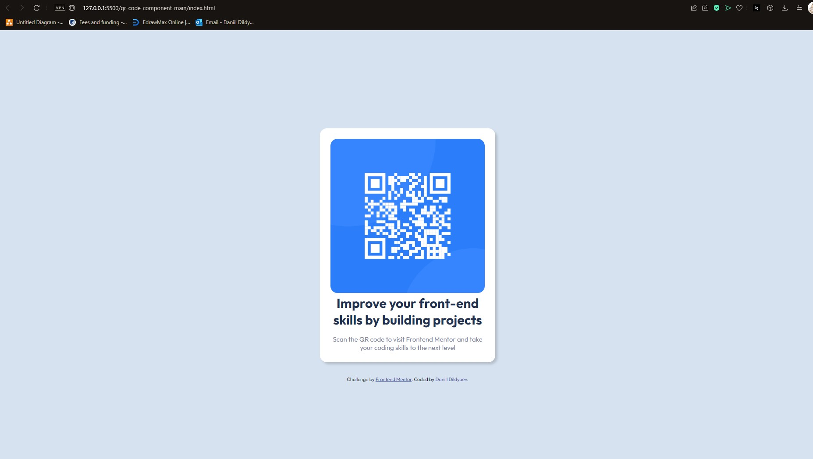

## Overview

### Screenshot



## My process

### Built with

-HTML 5
-CSS

### What I learned

```CSS
body {
  font-family: "Outfit", sans-serif;
  font-size: 15px;
  background-color: var(--Light-gray);
  display: flex;
  flex-direction: column;
  align-items: center;
  justify-content: center;
  height: calc(100vh - 1px);
  margin: 1.5rem;
```

As I am starting to use both CSS and HTML I had some help doing this. However, I start to understand it a bit more. Here, I learned how to get custom fonts and use them.
Also, I learned the use of display: flex, and what it does. How the alignment of columns works, and how it would affect if I had another h2 for example.
Additionally, while playing around with the code, I learned how the align items and justify content work, and why they are different.
For height, there is a sneaky 1px, which I was recommended, because it would return pixels, rather than vh. I was taught that on mobile screens that could cause some shaky feeling, which is obviously not desired at all. I think it works that way because every time vh changes, the elements inside the container readjust themselves.
On top of that, I learned the use of rem, as it can be seen in other components of the container. This is useful, as it allows for correct positioning.

```CSS
.container {
  background-color: var(--white);
  padding: 1.5rem;
  border-radius: 1rem;
  box-shadow: 5px 5px 5px rgba(0, 0, 0, 0.15);
  margin-bottom: 2rem;
}
```

Here's how my container was constructed. I learned how to set colour using the root element. Also learned the importance of padding, as otherwise it looked awful ^^. After just have completed my nea project for computing a-level, where I foolishly used pygame, this made me appreciate css so much, because I spent so much time battling pygame with pixel sizes and had to use a calculator to set it.
I also learned how to set shadow colour using the rgba. Whilst it isn't the most important part of the project, every little thing helps it look polished.
I am still a bit unsure of how the margins work, and will try to figure them out while doing more projects like this.

```HTML
  <body>
    <div class="container">
      
      <h1>Improve your front-end skills by building projects</h1>
      <p>
        Scan the QR code to visit Frontend Mentor and take your coding skills to
        the next level
      </p>
    </div>

    <div class="attribution">
      Challenge by
      <a href="https://www.frontendmentor.io?ref=challenge" target="_blank"
        >Frontend Mentor</a
      >. Coded by <a>Daniil Dildyaev</a>.
    </div>
  </body>
```

The code above was a good experience too look into how basic html code can be structured. I've learned the use of div and headings (I know it's the simplest of things, but this is just my beginning). This just gives a bit of an idea of how the hierarchical structure could look like and how you can use calsses to represent different things, like here the use of <a href=""
I was actually surprised by how little was put into html code, as I thought it would be more. But then, all the styling should be done in css, and therefore html is just building blocks as far as my understanding goes.

```CSS
.container img {
  border-radius: 1rem;
}

.container h1 {
  color: var(--dark-blue);
  text-align: center;
  margin-bottom: 1rem;
}

.container p {
  color: var(--grayish-blue);
  text-align: center;
}

.attribution {
  font-size: 15px;
  text-align: center;
}
.attribution a {
  color: hsl(228, 45%, 44%);
}
```

Here above was the code I used for the container specific rendering, which was surprisingly simpler than I thought it would be. Once again a bit of a gap in understanding margins, but that can easily be fixed with practise.

### Continued development

After finishing a long time doing work in python, I want to pick up HTML, CSS and JavaScript. This is my beginning and my baby steps. In future I intend to go deeper into web dev and want to pick up some good knowledge and grasp of it, as I go into uni. Hopefully I will stick to it and be able to produce a diverse portfolio, and do some work on fullstack, as I don't really see myself doing frontend only

### Useful resources

- https://htmlcheatsheet.com
- https://www.geeksforgeeks.org/css-cheat-sheet-a-basic-guide-to-css/

These are two websites that are literally just cheat sheets, however I don't yet know syntax well enough to go without them, so most likely will just keep using them until no longer needed.

## Author

- GitHub - [Dani-ldyaev](https://github.com/Dani-ldyaev)
- Frontend Mentor - [@Dani-ldyaev](https://www.frontendmentor.io/profile/Dani-ldyaev)
